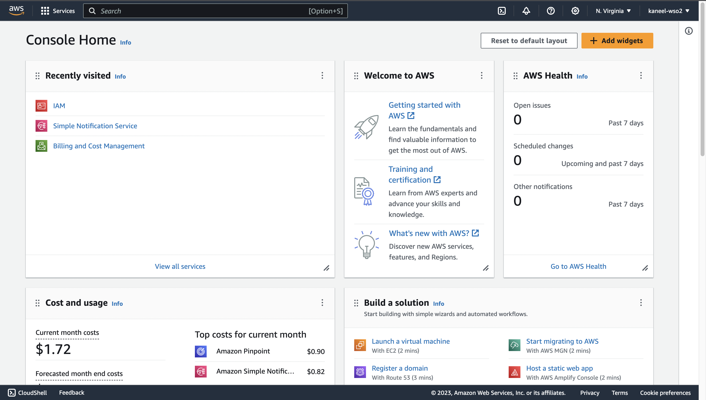
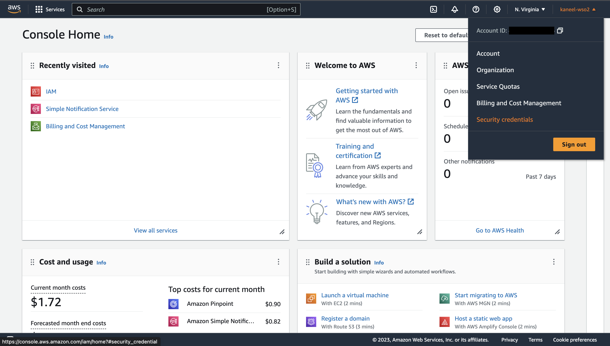
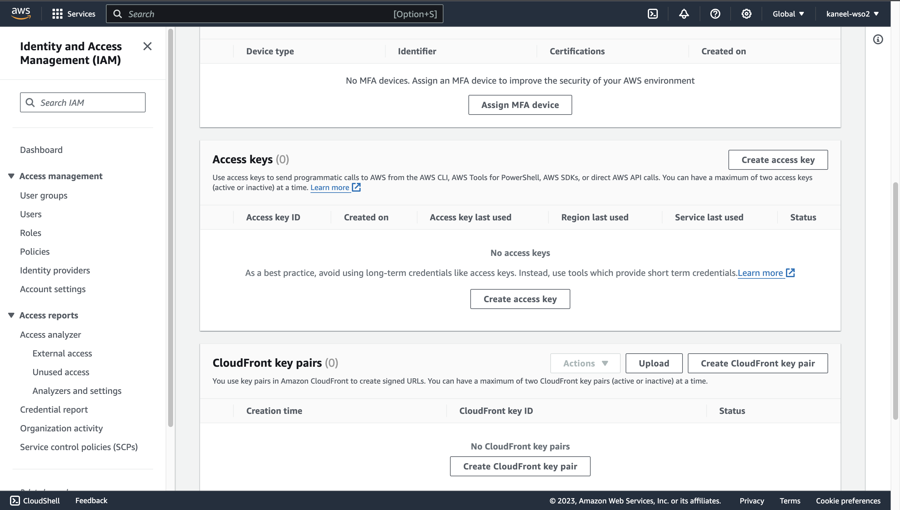
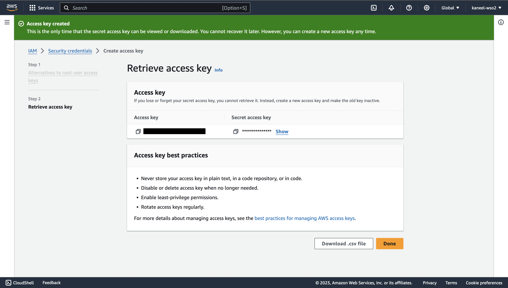

# Configure AWS SNS API

_Owners_: @kaneeldias \
_Reviewers_: @daneshk \
_Created_: 2023/11/28 \
_Updated_: 2023/11/28

## Introduction

To use the AWS SNS connector, you must have access to the AWS SNS REST API through an [Amazon Web Services (AWS)](https://aws.amazon.com/) account. If you do not have an AWS account, you can sign up for one [here](https://portal.aws.amazon.com/billing/signup).

1. Log into your [AWS console](https://console.aws.amazon.com/console/home).

   

2. Click on your account name in the top right corner to open the menu, and then click on `Security Credentials`.

   

3. Scroll down to the `Access keys` section and click on `Create access key`.

   

4. Copy the `Access key` and the `Secret access key` to a secure location. You will need these to configure the AWS SNS connector. You cannot view the secret access key again after this step. If you lose it, you must create a new access key pair.x

    